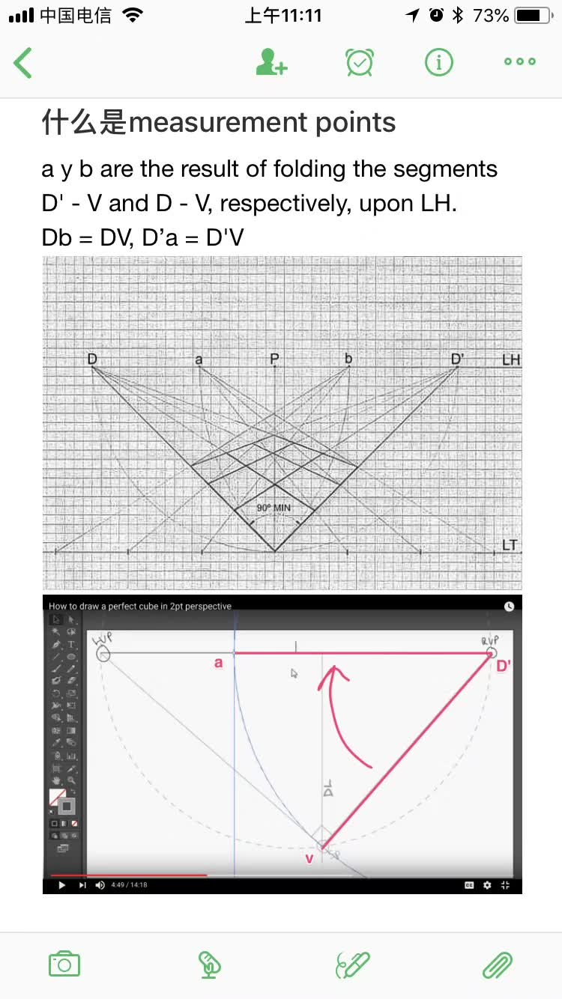

困扰我15年的透视画法（如何全凭想象真实还原人眼看到的景象）终于得到解答了。

掌握了The Double Fold的技法和Measurement Points的辅助，你就可以画出真实还原角度和长度的立体透视。

在网上查了好多资料，终于找到了真理所在（我怀疑大多数美术老师都不知道），向17世纪文艺复兴时期的艺术家们致敬！

资料：

https://www.handprint.com/HP/WCL/perspect1.html

http://freevst.x10.mx/tallerdedibujoypintura/english/perspective_01.htm

