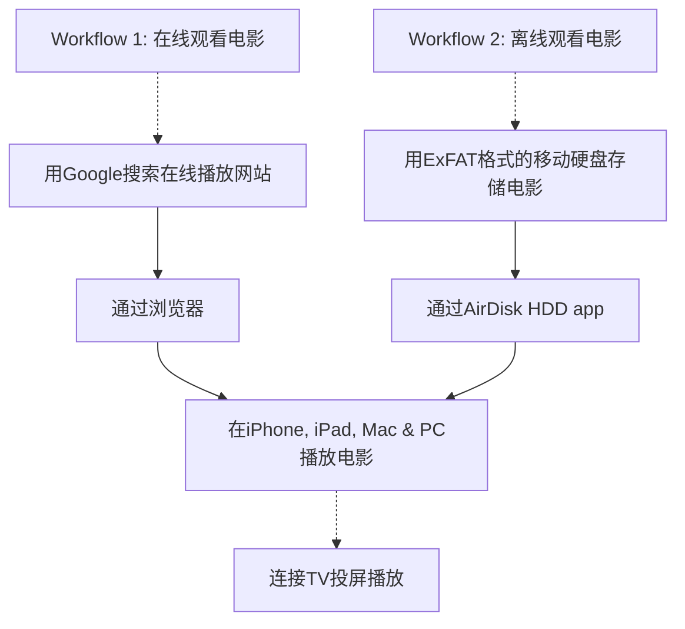

```mermaid
    graph TD
    T1[Workflow 1: 在线观看电影] -.-> A

    A[用Google搜索在线播放网站]
    A --> F[通过浏览器]
    F --> B[在iPhone, iPad, Mac & PC播放电影]
    B -.-> C[连接TV投屏播放]

    T2[Workflow 2: 离线观看电影] -.-> D

    D[用ExFAT格式的移动硬盘存储电影]
    D --> E[通过AirDisk HDD app]
    E --> B 
```

## 在线网站

Google搜索

## 电影存储

硬盘

## 观影设备

laptop

iPad

TV
