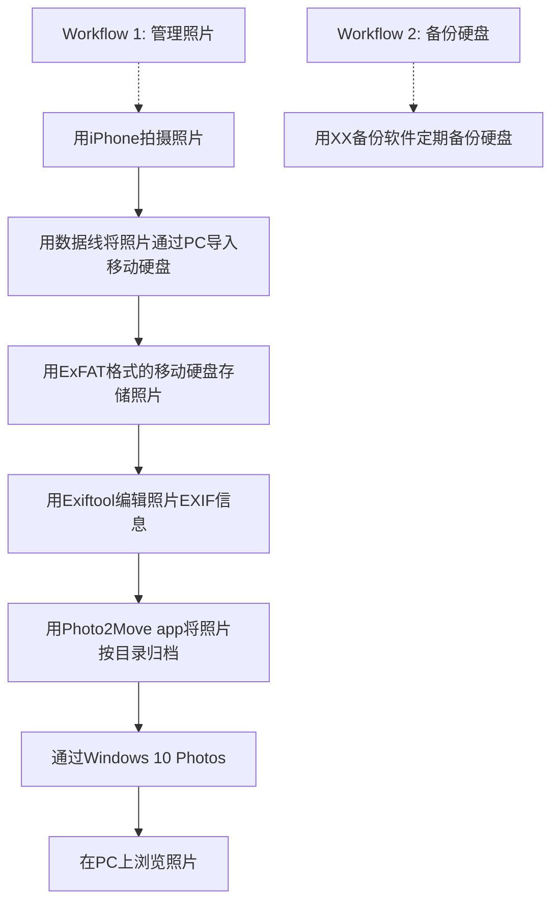

```mermaid
    graph TD
    T1[Workflow 1: 管理照片] -.-> E

    E[用iPhone拍摄照片]
    E --> G[用数据线将照片通过PC导入移动硬盘]
    G --> A[用ExFAT格式的移动硬盘存储照片]
    A --> H[用Exiftool编辑照片EXIF信息]
    H --> C[用Photo2Move app将照片按目录归档]
    C --> B[通过Windows 10 Photos]
    B --> D[在PC上浏览照片]

    T2[Workflow 2: 备份硬盘] -.-> I

    I[用XX备份软件定期备份硬盘]
```

## 照片存储

硬盘（ExFAT）

## 照片浏览器

Windows Photos

## 备份软件

- [ ]  寻找一款Windows free backup software

## EXIF编辑器

Exiftool

## 照片目录归档工具

Photo2Move
