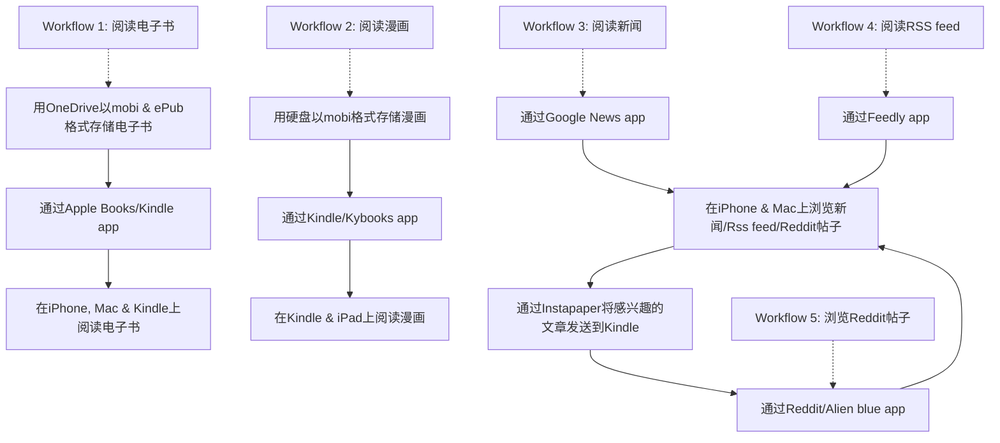

```mermaid
    graph TD
    T1[Workflow 1: 阅读电子书] -.-> A

    A[用OneDrive以mobi & ePub格式存储电子书]
    A --> F[通过Apple Books/Kindle app]
    F --> C[在iPhone, Mac & Kindle上阅读电子书]

    T2[Workflow 2: 阅读漫画] -.-> B

    B[用硬盘以mobi格式存储漫画]
    B --> E[通过Kindle/Kybooks app]
    E --> I[在Kindle & iPad上阅读漫画]

    T3[Workflow 3: 阅读新闻] -.-> G
    G[通过Google News app]
    G --> H[在iPhone & Mac上浏览新闻/Rss feed/Reddit帖子]
    H --> K[通过Instapaper将感兴趣的文章发送到Kindle]
    K --> L[在Kindle上阅读文章]

    T4[Workflow 4: 阅读RSS feed] -.-> J
    J[通过Feedly app]
    J --> H

    T5[Workflow 5: 浏览Reddit帖子] -.-> L
    L[通过Reddit/Alien blue app]
    L --> H
```

## 内容
- 电子书
- 漫画
- 新闻
- RSS feed
- Reddit帖子
- 网站

## 电子书存储

OneDrive (mobi & ePub)

## 漫画存储

硬盘（mobi）

## 阅读软件

Apple Books

Kindle

## 阅读设备

Kindle oasis

iPad

iPhone
