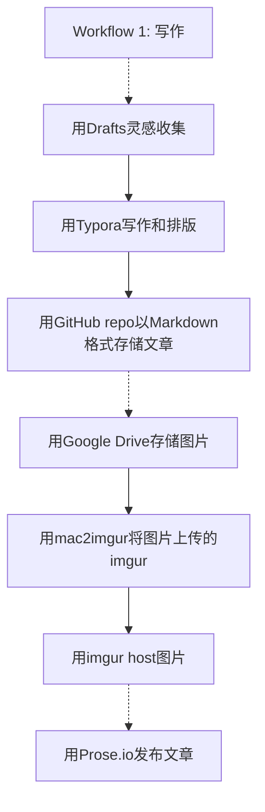

```mermaid
    graph TD
    T1[Workflow 1: 写作] -.-> D

    D[用Drafts灵感收集] --> E
    E[用Typora写作和排版] --> A
    A["用GitHub repo以Markdown格式存储文章"] -.-> F
    F[用Google Drive存储图片] --> B
    B[用mac2imgur将图片上传的imgur] --> C
    C[用imgur host图片] -.-> G
    G["用Prose.io发布文章"]
```

## 文章存储

GitHub repo (Markdown)

## 灵感收集

Drafts

## 写作排版软件

Typora

## 图片存储

Google Drive

## 图片hosting

imgur

## 图片上传工具

mac2imgur

## 文章发布

Git Push (VS Code)

Prose.io

GitHub网站
