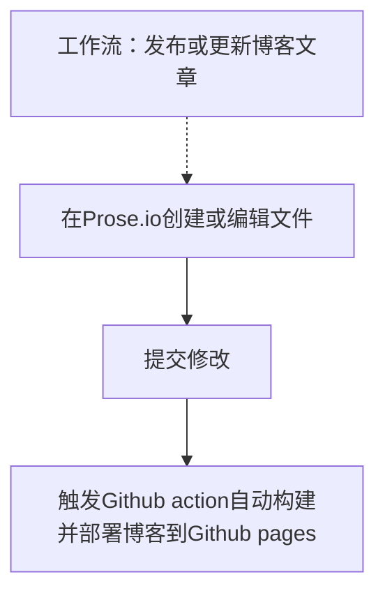

- TOC
  {:toc}

## 背景

大学时我为了保存和分享一些自己写的内容，比如学习笔记和思考总结，便希望有一个自己的博客。从 2010 年开始，我先后使用过 Google Blogger、Tumblr 和 Medium 作为自己的博客，在使用这些博客的过程中遇到的一个共同问题就是，每当我将博客文章迁移到新的平台时，总会遇到几个令我十分头疼的问题：

- 导出的博客文章为 HTML 格式，内容跟样式混杂在一起，可读性很低
- 我需要将导出的文章手动导入到新的博客系统（或者需要进行一定格式的调整）
- 自己基于博客主题定制的样式就浪费了

使用这几款博客平台的经历令我对主流的博客平台有些失望，主要的原因是感到自己的内容被限制在了特定的平台上。

直到有一天我偶然看到一篇博客（类似[这篇](https://github.com/paintedsky/dead-simple-blog)），作者介绍了自己如何使用简单的文本文件作为自己的博客（很像 Unix 的一切即文件哲学）。看了这篇文章后我深受启发，才知道原来博客还可以这么玩！

至此我才意识到，我对博客（以及任何内容平台）有着一个不可妥协的需求：

**内容独立性**。独立性主要体现在两个方面：

1. 内容应该能够自由地往来不同的平台。针对博客而言，就是文章可以轻松的从一个博客转移到另一个博客。
1. 内容的使用不依赖于特定平台。针对博客而言，就是文章从博客导出后可以直接查看和编辑。

以上两点与内容平台的利益是天然相违背的。如果希望做到内容的真正独立，依赖任何第三方平台都是不可靠的。一个绝对可靠的选择就是自己搭建博客。

那么问题来了，要自己动手搭建博客，一定绕不开的是维护成本的问题。为了能将更多的精力放到内容上，我理想中的自建博客应该能够：

**最小代码**，即该系统不需要或者需要极少的代码编写来使各种常用功能可用，包括：主题、评论、站内搜索等。

在寻找和比较了几款博客系统后，我最终选择了 Jekyll，因为它：

1. 支持使用极具可读性的 markdown 文件自动生成博客文章。
2. Jekyll 插件生态不错，各种功能基本都有现成工具可用，减少了代码的编写。

于是在 2017 年下半年，我开始利用些业余时间基于 Jekyll 和 Github pages 搭建自己的博客。

## 搭建博客的主要目标

我搭建博客有 2 个主要的目标：

1. 方便自己轻松写作并分享内容
1. 方便读者轻松发现并阅读感兴趣的内容

此外，也希望学习一下博客的运营和 SEO。

在过去的 3 年半时间里，我利用一些林散的时间学习 Jekyll 和相关工具的使用，一点点地完成了博客主要功能的搭建，过程中围绕这两个主要目标尝试过多种不同的解决方案来改进功能的使用。

目前博客的各种功能基本都找到了比较适合的解决方案，本文用来记录目前的整体设定，日后也会持续更新。

## 博客的发布工作流

为了方便自己轻松写作并分享内容，我一直在尝试优化 Jekyll 博客的发布工作流。

我心中理想的博客发布工作流是能**随时随地一键发布或更新文章**，这意味着我需要能通过手机发布和更新博客文章。而基于 Jekyll 和 Github pages 的博客一般发布内容都需要用到 Git 客户端，提交时还需要思考 commit message，操作比较繁琐，基本依赖于电脑来完成。

在尝试过 Jekyll admin, Working Copy 等工具后，我找到了[prose.io](http://prose.io/)，它完美的解决了发布 Jekyll 博客操作繁琐的问题，让随时发布博客成为了可能。

我目前基于 prose.io 的博客发布工作流如下图：




至此，我发布文章到 Jekyll 博客的工作流基本已经非常理想了。

## 博客的内容发现和阅读

目前阶段博客的访问人数不多，还无法很好地量化任何优化的效果，因此基本是本着最小可用的原则，只提供了一些自己认为必要的功能。

为了帮助读者快速发现和阅读感兴趣内容，博客目前支持：

- 通过国内域名访问
- 通过分类和标签浏览文章
- 支持手机阅读文章
- 评论文章和留言

博客目前还有很多地方有待改进，不过还是等我将内容的质量提高了，访问人数达到一定数量再来优化吧。

## 博客配置一览

以下是博客目前的主要提供的功能和对应的解决方案。

| 功能组件          | 目标用户   | 当前解决方案                                                               | 过往解决方案                                                                 |
| ----------------- | ---------- | -------------------------------------------------------------------------- | ---------------------------------------------------------------------------- |
| 博客系统          | 作者       | [Jekyll](https://jekyllrb.com/)                                            | [Wordpress.com](https://wordpress.com/), [hexo.io](https://hexo.io/)         |
| 部署方式          | 作者       | [Github actions](https://github.com/features/actions)                      | [Github pages](https://pages.github.com/)                                    |
| 发布工具          | 作者       | [prose.io](http://prose.io/)                                               | [Jekyll admin](https://github.com/jekyll/jekyll-admin)                       |
| 主题              | 读者       | [Jekyll minima latest](https://github.com/jekyll/minima) (3.x)             | Jekyll minima 2, [TeXt](http://jekyllthemes.org/themes/TeXt/)                |
| 评论工具          | 读者       | [utterances](https://github.com/utterance/utterances)                      | [disqus](https://disqus.com/)                                                |
| 图床              | 作者、读者 | [阿里云 OSS](https://www.aliyun.com/product/oss)                           | [imgur](https://imgur.com/), [Cloudinary](https://cloudinary.com/), 本地图片 |
| 图床上传工具      | 作者       | [PicGo](https://github.com/Molunerfinn/PicGo)                              | [mac2imgur](https://github.com/mileswd/mac2imgur), iPic, uPic                |
| 站内搜索          | 读者       | [Google Custom Search](https://programmablesearchengine.google.com/about/) | -                                                                            |
| 统计分析          | 作者       | [Google Analytics](https://analytics.google.com/analytics/web/)            | -                                                                            |
| 图表              | 作者、读者 | [Chart.js](https://www.chartjs.org/)                                       | TeXt                                                                         |
| 图示              | 作者、读者 | [mermaid.js](https://mermaidjs.github.io/)                                 | [jekyll-spaceship](https://github.com/jeffreytse/jekyll-spaceship), TeXt     |
| 内嵌 YouTube 视频 | 作者、读者 | YouTube 内嵌代码                                                           | jekyll-spaceship, TeXt                                                       |
| 域名              | 读者       | [阿里云](https://www.aliyun.com/)                                          | github.io                                                                    |

## 解决方案对比

#### 博客系统

| 配置选项  | Pros                                              | Cons                         |
| --------- | ------------------------------------------------- | ---------------------------- |
| Jekyll    | 简单，可靠，插件生态不错                          | 编译慢，文章多了需要性能调优 |
| hexo      | 构建速度很快，node.js 比 Rails 更适合构建 UI 组件 | 很多功能需要插件完成         |
| Wordpress | 生态强大，能导出文章为 markdown                   | 内容编辑不如 markdown 纯粹   |

hexo 是一款基于 node.js 的静态网站构建工具，作者是台湾人，因此在华人圈子中有不小名气。曾经冲着它构建速度快的特点试用了一下，实际使用没想象中优秀，最终未采用。

#### 部署方式

| 配置选项       | Pros                                               | Cons                                                               |
| -------------- | -------------------------------------------------- | ------------------------------------------------------------------ |
| Github actions | 灵活，自由，支持各种自动化，不受 github pages 限制 | 需要编写 workflow                                                  |
| Github pages   | Github 原生支持，自动                              | 不支持 github pages whitelist 以外的 Jekyll 插件，比如 paginate v2 |

#### 发布方式

| 配置选项     | Pros                                                        | Cons                              |
| ------------ | ----------------------------------------------------------- | --------------------------------- |
| prose.io     | 在线编辑，无需 Git 客户端，支持 Markdown 格式，支持手机访问 | 没有客户端，频繁 Authorize 验证   |
| Jekyll admin | 离线编辑                                                    | 需要 Git 客户端，不支持手机发文章 |

prose.io 是一款针对 Github 的内容编辑器，支持在线编辑 Github repo 文件。

#### 主题

| 配置选项      | Pros                                       | Cons                                     |
| ------------- | ------------------------------------------ | ---------------------------------------- |
| Minima latest | 简洁，功能够用                             | 不支持 Github pages 自动构建             |
| Minima 2      | 简洁，Github pages 原生支持                | 老旧了，有些功能不支持，比如 paginate v2 |
| TeXt          | 好看，功能非常丰富，比如支持 Chart.js 图表 | 臃肿，文档支持不够完善，工具版本受限     |

TeXt 是一款好看又强大的 Jekyll 主题，而且还是国人出品，Github 上有 2 千多用户。对于崇尚 minimalist 的我，等哪天觉得 minima 不够应该会首先尝试它。

#### 评论工具

| 配置选项   | Pros                               | Cons                |
| ---------- | ---------------------------------- | ------------------- |
| utterances | 支持国内访问，数据中立，简洁，好用 | 只支持 Github login |
| disqus     | 免费，支持各种 Social login        | 干扰信息多          |

utterances 是一款轻量级评论插件，利用了 Github issues 作为评论系统。

#### 图床

| 配置选项   | Pros                                                          | Cons                                          |
| ---------- | ------------------------------------------------------------- | --------------------------------------------- |
| 阿里云 OSS | 便宜，支持国内访问，无干扰，简单                              | -                                             |
| imgur      | 免费，无干扰，无限空间，简单，使用 mac2imgur app 拖拽图片上传 | 不支持国内访问                                |
| 本地图片   | Accessibility，文档和图片数据集中                             | 图片 repo 空间的 scale 问题，以及网络访问速度 |

#### 图床上传工具

| 配置选项  | Pros                                                                                                                               | Cons                        |
| --------- | ---------------------------------------------------------------------------------------------------------------------------------- | --------------------------- |
| PicGo     | 免费，支持国内主流图床，全平台支持（包括手机），支持插件（如，[图床迁移工具](https://github.com/PicGo/picgo-plugin-pic-migrater)） | Menu bar icon 很丑          |
| mac2imgur | 免费，超级简单好用                                                                                                                 | 只支持 imgur 上传，停止维护 |
| iPic      | 好看，功能齐全，好用                                                                                                               | 每年 60 元                  |
| uPic      | 好看，功能齐全，好用                                                                                                               | 30 元                       |

#### 站内搜索

| 配置选项                                                                      | Pros                           | Cons                                                        |
| ----------------------------------------------------------------------------- | ------------------------------ | ----------------------------------------------------------- |
| Google Custom Search                                                          | 免费，自动                     | 不支持国内访问，索引更新周期长，样式可能会被全局污染        |
| [Jekyll Simple Search](https://github.com/christian-fei/Simple-Jekyll-Search) | 简单，免费，自动，支持国内访问 | 打开全文检索会使 build 和页面加载速度受影响，需要自己写样式 |

Google Custom Search 是谷歌提供的站内搜索工具，可以通过[Google Search Conssole](https://search.google.com/search-console)查看站内链接索引情况，搜索结果的优化相当于同时做了 Google SEO。

#### 统计分析

| 配置选项         | Pros                             | Cons                   |
| ---------------- | -------------------------------- | ---------------------- |
| Google Analytics | 功能强大，自动，支持统计国内流量 | 管理界面不支持国内访问 |

#### 图表、图示、内嵌 YouTube 视频

图表、图示和内嵌 YouTube 视频的情况类似，都是纯前端展示的功能，下面以图示为例进行详细对比。

| 配置选项         | Pros                                                             | Cons                                                             |
| ---------------- | ---------------------------------------------------------------- | ---------------------------------------------------------------- |
| mermaid.js       | 无需依赖 Rails 技术栈，无需修改 pipeline，功能不受限，版本不受限 | 不支持本地显示，需要管理 JavaScript library                      |
| jekyll-spaceship | 部分编辑器支持本地显示                                           | 依赖 Rails 技术栈，需要搭建相关 pipeline，交互功能受限，版本受限 |

jekyll-spaceship 是一款集多种实用功能于一身的 Jekyll 插件，提供了对表格、数学公式、图示、音频、视频、表情符号等内容的支持。插件功能都挺好，就是 build 时间会显著加长。

#### 域名

| 配置选项   | Pros                           | Cons                  |
| ---------- | ------------------------------ | --------------------- |
| 阿里云域名 | 支持国内访问，便宜             | 需要单独配置 SSL 证书 |
| github.io  | Github pages 自带，自动，https | 不支持国内访问        |

## 自定义代码

### 使用 github action 部署 Jekyll 博客的 workflow

为了自动化构建并部署静态 Jekyll site 到 Github pages，在参考了网上几种 Jekyll 部署的 workflow 之后，我写了一个部署脚本完成这项工作。

`publish_to_blog.yml`:



```yaml
name: Publish to my blog

on: [push]

jobs:
  build:
    runs-on: ubuntu-latest

    steps:
      - uses: actions/checkout@v2
        with:
          persist-credentials: false # otherwise, the token used is the GITHUB_TOKEN, instead of your personal token

      - name: Setup Ruby
        uses: ruby/setup-ruby@v1
      - name: Ruby gem cache
        uses: actions/cache@v1
        with:
          path: vendor/bundle
          key: ${{ runner.os }}-gems-${{ hashFiles('**/Gemfile.lock') }}
          restore-keys: |
            ${{ runner.os }}-gems-
      - name: Install gems
        run: |
          bundle config path vendor/bundle
          bundle install --jobs 4 --retry 3

      - name: Build Jekyll site
        run: JEKYLL_ENV=production bundle exec jekyll build

      - name: Commit files
        run: |
          cd ./_site
          git init
          git config --local user.name "Your Name"
          git config --local user.email "Your Email Address"
          git add .
          git commit -m "jekyll build at $(date)"
      - name: Push changes
        uses: ad-m/github-push-action@master
        with:
          directory: ./_site
          repository: goooooouwa/goooooouwa.github.io
          branch: gh-pages
          github_token: ${{ secrets.PERSONAL_ACCESS_TOKEN }}
          force: true
```



### 对 Jekyll minima 主题的自定义

本着最小代码的原则，仅对 Jekyll minima 主题做了如下必要修改：

1. 主题内容本地化
2. 解决 Google custom search 样式问题

Google custom search 的样式会被 Bootstrap 的全局样式覆盖，导致搜索框样式失效，网上搜索之后，采用了样式隔离的方式来保护 Google custom search 的样式不被影响，一劳永逸。

`google-custom-search-style-fix.scss`:



```scss
---
---

.google-custom-search {
  table {
    margin-bottom: initial;
    width: initial;
    text-align: initial;
    color: initial;
    border-collapse: initial;
    border: initial;
    tr {
      &:nth-child(even) {
        background-color: initial;
      }
    }
    th,
    td {
      padding: initial;
    }
    th {
      background-color: initial;
      border: initial;
      border-bottom-color: initial;
    }
    td {
      border: initial;
    }
  }
}
```



### 自己开发的小工具

为了将我的 evernote 笔记迁移到 Jekyll，我需要：

1. 将 evernote 导出的 html 文件转化为 markdown 格式

2. 添加 front matter 以导入 Jekyll

我在尝试多种工具都不理想后，自己写了一点脚本来帮助完成这项工作，在[evernote2markdown](https://github.com/goooooouwa/evernote2markdown)。

## Todo

下面是一些目前还未很好做到的事情，欢迎留言提供建议。

- [ ] 轻松为 markdown 文件添加 front matter

- [ ] 为 markdown 文件生成带日期的文件名

- [ ] 为 markdown 文件添加带连字符的英文名

- [x] 支持国内访问、从 imgur 迁移成本低的图床: PicGo with 阿里云 OSS

- [x] 站内搜索的替代方案，确保国内可用: jekyll simple search

## 最后

以上就是我的博客目前的设定，想了解更多细节可以直接访问 Github 代码仓库：[goooooouwa/goooooouwa.github.io](https://github.com/goooooouwa/goooooouwa.github.io)。
