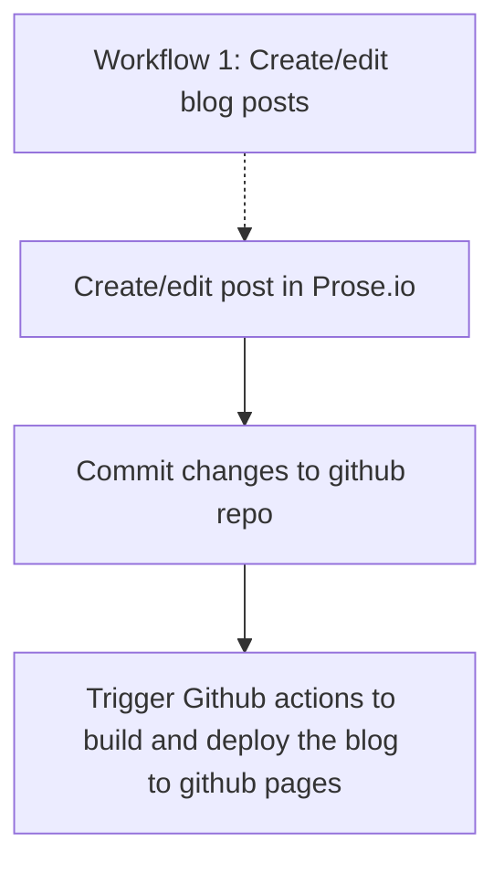

## Blog

Jekyll repo + Github actions

## Jekyll文件管理

[ ] 轻松为markdown文件添加front matter

为markdown文件生成带日期的文件名

为markdown文件添加带连字符的英文名

## 工具

- 在线编辑文章: prose.io
- 批量修改：VS Code
- 批量添加front matter：[evernote2markdown](https://github.com/goooooouwa/evernote2markdown)
