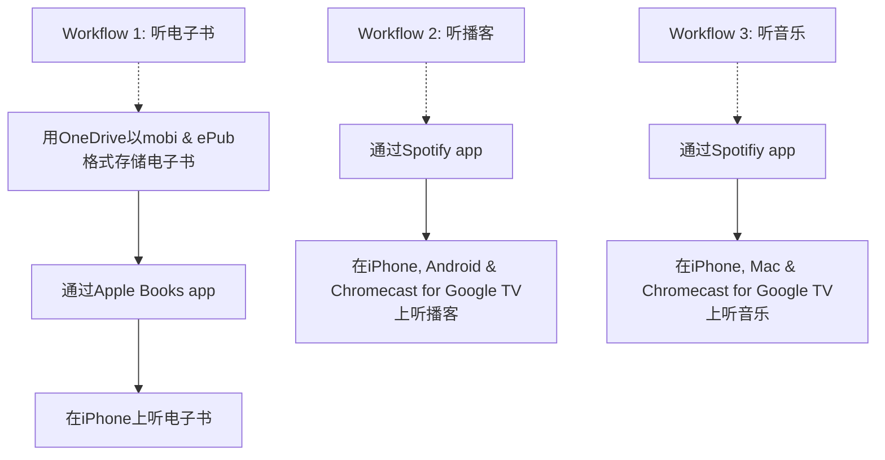

```mermaid
    graph TD
    T1[Workflow 1: 听电子书] -.-> A

    A[用OneDrive以mobi & ePub格式存储电子书]
    A --> F[通过Apple Books app]
    F --> C[在iPhone上听电子书]

    T2[Workflow 2: 听播客] -.-> E

    E[通过Spotify app]
    E --> I[在iPhone, Android & Chromecast for Google TV上听播客]

    T3[Workflow 3: 听音乐] -.-> G
    G[通过Spotifiy app]
    G --> H[在iPhone, Mac & Chromecast for Google TV上听音乐]
```

## 内容
- 听书
- 听播客
- 听音乐

## 播放软件

- Apple Books
- Google Podcasts
- Spotify

## 音频设备

iPhone
